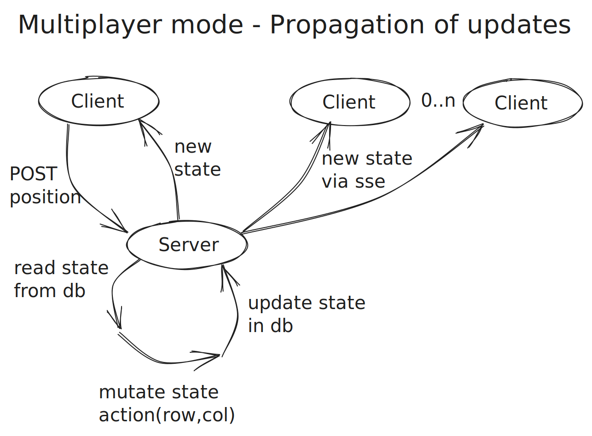

# Abalone

## Try it out

If [this link](https://try1-xm6btgq3aq-ey.a.run.app) does not work your out of luck, unless you wanna clone this project and run:
```
    pnpm install
    pnpm run dev
```

## Features which may be implemented
- online rust as BE

## Docs

### State machine

https://excalidraw.com/#json=6Las9ReGCRGorfTdfzd5Q,S-wy4zwe2W6hntF814-fWw


### Multiplayer mode - Propagation of updates

https://excalidraw.com/#json=YEEecxkk1UItVkoSU0w91,ATbyxuop4MQwdUIPPpef3A
